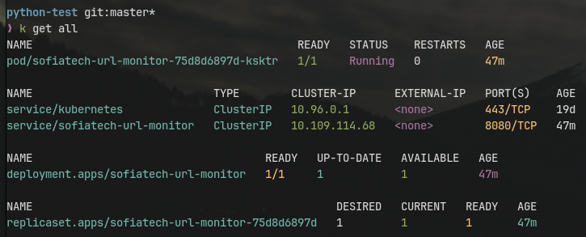
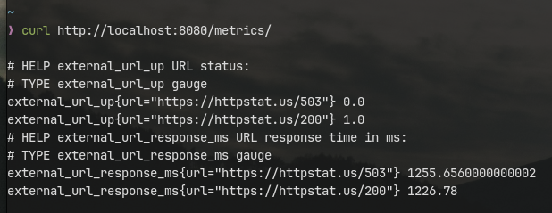

# Task for Cloud Platform Team at Sofia Tech Hub

A simple Python service that monitors the availability and response time of two external URLs (`https://httpstat.us/503` and `https://httpstat.us/200`) and exposes the metrics in a Prometheus-compatible format.

## Table of Contents

- [Task Requirements](#task-requirements)
- [Design Decisions](#design-decisions)

- [Setup Instructions](#setup-instructions)
  - [Local Setup](#local-setup)
  - [Docker Setup](#docker-setup)
  - [Kubernetes Setup](#kubernetes-setup)

---

## Task Requirements

- Create a Git repository (on GitHub or GitLab).
- Create a simple Python project that:
  - Queries two URLs:
    - `https://httpstat.us/503`
    - `https://httpstat.us/200`
  - Checks if the external URLs are up (HTTP status code `200`).
  - Measures and records the response time in milliseconds.
- The service should:
  - Run a simple HTTP server.
  - Produce Prometheus-formatted metrics at a service URL endpoint.

### Expected Prometheus Metrics Output Example:

```text
sample_external_url_up{url="https://httpstat.us/503"} = 0
sample_external_url_response_ms{url="https://httpstat.us/503"} = [value]
sample_external_url_up{url="https://httpstat.us/200"} = 1
sample_external_url_response_ms{url="https://httpstat.us/200"} = [value]
```

### Looking for

- Good readme providing instructions what are the steps to run the python app in a k8s cluster.
- Dockerfile to build image.
- Helm chart to deploy this container on Kubernetes.
- Hint: use helm create
- Hint: Use Python prometheus-client module

## Design Decisions

To ensure that Prometheus scrapes the /metrics endpoint efficiently, the decision to use background thread to continuously collect metrics was made. The background thread runs in an infinite loop, and every 10s it:

- Queries the external URLs
- Updates Prometheus metrics

This ensures that the metrics are always up-to-date when scraped, but also have way faster response times.

That way the /metrics endpoint remains responsive and ready for Prometheus to scrape with minimal overhead.

This approach is one of many, but it provides a straightforward and simple solution.

## Setup Instructions

### Local Setup

The following must be installed:

- Python 3.x
- pip (Python package installer)

1. (Optional but recommended) Create & Start virtual environment:

```bash
python3 -m venv venv
source venv/bin/activate
```

2. Install required dependencies:

```bash
pip install -r requirements.txt
```

3. Start the service with:

```bash
python run.py
```

for production use:

```bash
gunicorn -b 0.0.0.0:8080 run:app
```

4. After running the application Prometheus metrics will be available on:
   `http://localhost:8080/metrics/`

### Docker Setup

1. Dockerize the application by running:

```bash
docker build -t sofiatech-url-monitor:latest .
```

2. Once the image is built, run a container port-forwarding the port

```bash
docker run -p <port-of-your-choice>:8080 --name sofiatech-url-monitor -d sofiatech-url-monitor:latest
```

3. Prometheus metrics should be availble on:
   `http://localhost:<port-of-your-choice>/metrics/`

### Kubernetes Setup

#### Prerequisites

Make sure you have installed:

- Docker
- kubectl
- Helm
- K8s Cluster

1. (Optional) If you don't have a cluster running. Create one with minikube.

- Follow the [Minikube](https://minikube.sigs.k8s.io/docs/start) installation guide
- After installation run `minikube start`
- The check your `kubectl` connection with:

```bash
kubectl get all
```

2. Install the Helm Chart

- The Helm Chart's `sofiatech-url-monitor/values.yaml` have already been configured to run without any extra configuration.
- The Helm Chart pulls from the image from Dockerhub.
- [Link to Dockerhub Repo](https://hub.docker.com/repository/docker/alexupenev/sofiatech-url-monitor/general)

To run exectute the following command:

```bash
helm install sofiatech-url-monitor ./sofiatech-url-monitor
```

After the installation, you should see the following output when executing `kubectl get all`:



3. Access the Application

The service is internal by default (ClusterIP). That means that it will be accessible inside the k8s network on the following url:

`http://sofiatech-url-monitor.default.svc.cluster.local:8080/metrics/`

To access the application locally you can use the following command to port-forward the service:

```
kubectl port-forward service/sofiatech-url-monitor <port-of-your-choice>:8080
```

Now the Prometheus metrics can be accessed at:

`http://localhost:<port-of-your-choice>/metrics/`

4. Validation

Once the service is running, verify by accessing the `/metrics` endpoint:

```bash
curl http://localhost:8080/metrics/
```

You should see output similar to:



5. (Optional) Uninstal and stop all local processes

```bash
helm uninstall sofiatech-url-monitor
minikube stop
```
